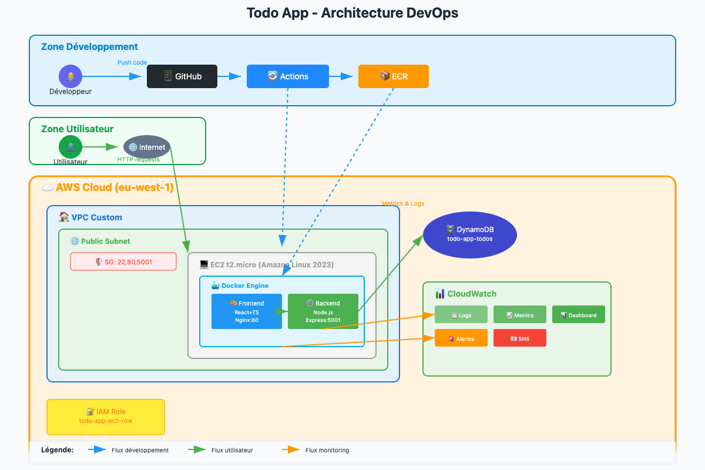

  

# Application Todo - Architecture Cloud DevOps
Plateforme de gestion de tâches en utilisant une architecture moderne avec React, Node.js et une infrastructure AWS automatisée, containerisation Docker avec un déploiement continu via GitHub Actions.


## 🎯 Vue d'ensemble

Cette application Todo démontre l'implémentation d'une stack DevOps en intégrant :

* **Application React TypeScript** : Interface responsive avec design moderne et dark mode
* **API Node.js Express** : Backend REST connecté à DynamoDB pour la persistance
* **Infrastructure Terraform** : Provisioning automatisé d'une infrastructure AWS complète
* **Automatisation GitHub Actions** : Pipeline d'intégration et déploiement continus
* **Conteneurisation Docker** : Images optimisées pour développement et production
* **Supervision CloudWatch** : Monitoring complet avec métriques et alertes
* **Sécurité intégrée** : Configuration IAM, headers sécurisés, et registre ECR privé

  

### Fonctionnalités applicatives

 - **Gestion complète des tâches :** Création, modification, suppression et
   marquage comme terminé
 - **Interface utilisateur moderne** : Thème sombre avec animations fluides
   et responsive design
 - **Édition instantanée :** Modification des tâches directement dans
   l'interface
 - **Dashboard en temps réel** : Statistiques visuelles (total, actives,
   terminées)
 - **Experience mobile :** Interface adaptée à tous les écrans
 - **Santé applicative :** Endpoints de monitoring intégrés
 - **Résilience :** Gestion automatique des erreurs avec retry et feedback
   utilisateur


## 🏗️ Architecture

    Frontend React/TypeScript → Nginx (Port 80)
    ↓
    Backend Node.js/Express → Port 5001
    ↓
    Amazon DynamoDB

**Stack AWS déployée :**

-   **EC2** : Instance t2.micro avec Amazon Linux 2023 et Docker
-   **DynamoDB** : Base NoSQL avec facturation à l'usage
-   **ECR** : Registre Docker privé pour les images applicatives
-   **VPC** : Réseau virtuel avec subnet public et règles de sécurité
-   **CloudWatch** : Centralisation des logs, métriques et dashboards
-   **IAM** : Gestion des accès avec rôles spécialisés



## 📋 Prérequis

### Comptes requis
-   **Compte AWS** actif avec accès Free Tier
-   **Repository GitHub** pour héberger le code et les workflows
-   **Clé SSH AWS** créée et nommée `todo-app-key`

### Installation des outils

```bash
# Installation AWS CLI v2
curl "https://awscli.amazonaws.com/awscli-exe-linux-x86_64.zip" -o "awscliv2.zip"
unzip awscliv2.zip
sudo ./aws/install

# Installation Terraform
wget https://releases.hashicorp.com/terraform/1.6.0/terraform_1.6.0_linux_amd64.zip
unzip terraform_1.6.0_linux_amd64.zip
sudo mv terraform /usr/local/bin/

# Installation Docker et Docker Compose
sudo apt update
sudo apt install docker.io docker-compose-plugin
sudo usermod -aG docker $USER

# Installation Node.js 18 LTS
curl -fsSL https://deb.nodesource.com/setup_18.x | sudo -E bash -
sudo apt-get install -y nodejs

# Installation Git
sudo apt install git
```

### Configuration initiale AWS

```bash
# Configuration des credentials AWS
aws configure
# Entrez vos informations :
# AWS Access Key ID: [votre-access-key]
# AWS Secret Access Key: [votre-secret-key]  
# Default region name: eu-west-1
# Default output format: json

# Vérification de la configuration
aws sts get-caller-identity

# Création d'un VPC par défaut si nécessaire
aws ec2 create-default-vpc --region eu-west-1
```


## 🚀 Installation rapide

### 1. Récupération du projet

```bash
# Clonage du repository
git clone <repository-url>
cd todo-app

# Vérification de la structure du projet
ls -la
# Doit contenir : client/ server/ infrastructure/ scripts/ docker-compose.yml
```

### 2. Configuration GitHub Secrets

| Nom du Secret | Valeur | Description |
|---------------|--------|-------------|
| `AWS_ACCESS_KEY_ID` | Votre AWS Access Key | Identifiant pour l'accès AWS |
| `AWS_SECRET_ACCESS_KEY` | Votre AWS Secret Key | Clé secrète pour l'authentification AWS |
| `AWS_ACCOUNT_ID` | Votre numéro de compte AWS | Requis pour l'accès ECR |
| `EC2_HOST` | IP publique de l'instance EC2 | Adresse pour le déploiement SSH |
| `EC2_SSH_PRIVATE_KEY` | Contenu de la clé privée SSH | Clé complète pour la connexion EC2 |

### 3. Déclenchement du déploiement

```bash
# Création d'une branche pour le déploiement
git checkout -b deploy

# Ajout et commit des modifications
git add .
git commit -m "Configuration pour déploiement automatique"
git push --set-upstream origin deploy

# Création d'une Pull Request vers main dans GitHub
# Le pipeline GitHub Actions démarre automatiquement le déploiement !
```

## 💻 Développement local

### Démarrage automatisé

```bash
# Lancement de l'environnement de développement complet
./scripts/dev-start.sh

# Lancement avec reconstruction des images
./scripts/dev-start.sh --build
```

### Démarrage manuel avec Docker Compose

```bash
# Démarrage de tous les services
docker compose up -d

# Suivi des logs en temps réel
docker compose logs -f

# Arrêt propre de tous les services
docker compose down
```

### Points d'accès en développement

-   **Frontend React Dev** : http://localhost:3000 (avec hot reload)
-   **API Backend** : http://localhost:5001
-   **DynamoDB Local** : http://localhost:8000
-   **DynamoDB Admin UI** : http://localhost:8001

### Exécution des tests

```bash
# Tests du frontend avec React Testing Library
cd client
npm test

# Tests avec rapport de couverture
npm test -- --coverage

# Tests du backend (Jest configuré)
cd server
npm test
```


## ☁️ Déploiement sur AWS

### Méthode 1 : Déploiement automatisé (Recommandé)

1.  **Configurez les secrets GitHub** selon la section Installation rapide
2.  **Créez une Pull Request vers la branche main**
3.  **GitHub Actions gère automatiquement** le provisioning infrastructure et le déploiement applicatif

### Méthode 2 : Déploiement manuel étape par étape

#### Étape 1 : Provisioning de l'infrastructure

```bash
cd infrastructure

# Initialisation du workspace Terraform
terraform init

# Prévisualisation des ressources à créer
terraform plan

# Création de l'infrastructure AWS
terraform apply
# Confirmez en tapant 'yes'

# Récupération des informations de déploiement
terraform output
```

#### Étape 2 : Construction et publication des images Docker

```bash
# Retour à la racine du projet
cd ..

# Construction et push vers ECR
./scripts/build-images.sh --push
```

#### Étape 3 : Déploiement applicatif

```bash
# Déploiement standard
./scripts/deploy.sh

# Déploiement complet avec monitoring
./scripts/deploy-complete.sh
```

### Récupération des URLs d'accès

```bash
cd infrastructure
terraform output app_urls
```

## 🔄 Pipeline CI/CD

Le workflow GitHub Actions s'exécute automatiquement en 3 étapes séquentielles :

### 1. **Phase de Tests** (Job: test)

```yaml
- Récupération du code source depuis GitHub
- Configuration Node.js 18 avec optimisation du cache npm
- Exécution des tests frontend React avec couverture de code
- Installation et vérification des dépendances backend
- ❌ Arrêt du pipeline en cas d'échec des tests

```

### 2. **Construction et Publication** (Job: build-and-push)

```yaml
- Construction des images Docker pour client et server
- Authentification et push vers Amazon ECR
- Étiquetage des images avec le tag 'latest'

```

### 3. **Déploiement Production** (Job: deploy)

```yaml
- Connexion SSH sécurisée vers l'instance EC2
- Génération dynamique du fichier docker-compose.yml production
- Téléchargement des nouvelles images depuis ECR
- Redémarrage des services sans downtime
- Validation automatique via health checks

```

### Événements de déclenchement

-   **Push de code** vers les branches `main` ou `master`
-   **Pull Requests** ciblant les branches `main` ou `master`

### Monitoring de l'exécution

-   Consultez l'onglet **Actions** de votre repository GitHub pour suivre l'avancement
-   Les URLs d'accès à l'application sont affichées dans les logs de fin de déploiement

## 🛠️ Scripts utiles

### Scripts de développement

```bash
# Gestion de l'environnement de développement
./scripts/dev-start.sh              # Démarrage des services développement
./scripts/dev-start.sh --build      # Démarrage avec reconstruction complète

# Gestion des images Docker
./scripts/build-images.sh           # Construction locale des images
./scripts/build-images.sh --push    # Construction et publication vers ECR

```

### Scripts de déploiement

```bash
# Options de déploiement
./scripts/deploy.sh                 # Déploiement rapide sur EC2 existant
./scripts/deploy-complete.sh        # Déploiement avec provisioning Terraform complet

```

### Commandes Docker fréquentes

```bash
# Gestion des conteneurs
docker compose ps                   # État des conteneurs
docker compose logs -f              # Logs en temps réel de tous les services
docker compose logs client          # Logs spécifiques au frontend
docker compose logs server          # Logs spécifiques au backend

# Opérations sur les services
docker compose restart client       # Redémarrage du frontend uniquement
docker compose restart server       # Redémarrage du backend uniquement
docker compose up --build -d        # Reconstruction et redémarrage complet

# Maintenance et nettoyage
docker image prune -f               # Suppression des images inutilisées
docker system prune -f              # Nettoyage complet du système Docker

```

### Commandes AWS courantes

```bash
# Authentification ECR
aws ecr get-login-password --region eu-west-1 | docker login --username AWS --password-stdin 135808930620.dkr.ecr.eu-west-1.amazonaws.com

# Gestion des images ECR
aws ecr list-images --repository-name todo-app-client --region eu-west-1
aws ecr list-images --repository-name todo-app-server --region eu-west-1

# Accès SSH à l'instance EC2
ssh -i ~/.ssh/todo-app-key.pem ec2-user@<ADRESSE_IP_PUBLIQUE>

# Consultation des métriques CloudWatch
aws cloudwatch get-metric-statistics \
  --namespace "TodoApp/API" \
  --metric-name "RequestCount" \
  --start-time 2024-01-01T00:00:00Z \
  --end-time 2024-01-02T00:00:00Z \
  --period 3600 \
  --statistics Sum \
  --region eu-west-1

```


## 📊 Monitoring et surveillance

### Dashboard CloudWatch

Accédez aux tableaux de bord via les outputs Terraform :

```bash
cd infrastructure
terraform output monitoring_urls

```

**Métriques monitored en temps réel :**

-   **Infrastructure EC2** : Utilisation CPU, trafic réseau entrant/sortant, utilisation mémoire
-   **Base DynamoDB** : Consommation unités de lecture/écriture, latence des requêtes
-   **Application** : Nombre de requêtes, taux d'erreur, temps de réponse moyen

### Gestion des logs CloudWatch

```bash
# Listing des groupes de logs disponibles
aws logs describe-log-groups --region eu-west-1

# Suivi en temps réel des logs applicatifs
aws logs tail /aws/todo-app/server --follow --region eu-west-1
aws logs tail /aws/todo-app/client --follow --region eu-west-1

```

### Système d'alertes automatiques

-   **Alerte CPU élevé** : Déclenchée si CPU > 80% sur 2 mesures consécutives
-   **Alerte erreurs API** : Déclenchée si erreurs > 5 dans une fenêtre de 5 minutes
-   **Notifications SNS** : Configurables pour recevoir les alertes par email/SMS

### Endpoints de santé

```bash
# Vérification santé de l'API
curl http://<ADRESSE_IP_PUBLIQUE>:5001/health

# Récupération des métriques applicatives
curl http://<ADRESSE_IP_PUBLIQUE>:5001/metrics

# Test d'accessibilité du frontend
curl http://<ADRESSE_IP_PUBLIQUE>

```

### Consultation des logs sur l'instance

```bash
# Connexion directe à l'instance EC2
ssh -i ~/.ssh/todo-app-key.pem ec2-user@<ADRESSE_IP_PUBLIQUE>

# Navigation vers le répertoire applicatif
cd /home/ec2-user/todo-app
docker compose logs -f

# Consultation des logs système Docker
sudo journalctl -u docker -f

```


## 🔧 Dépannage

### Problèmes fréquents et solutions

#### Échec du pipeline GitHub Actions

```bash
# Vérification des secrets GitHub
# Aller dans Settings → Secrets and variables → Actions

# Problème d'authentification ECR
# Contrôler la valeur de AWS_ACCOUNT_ID dans les secrets

# Erreur de connexion SSH
# Vérifier EC2_SSH_PRIVATE_KEY et EC2_HOST dans les secrets

```

#### Services non fonctionnels sur EC2

```bash
# Connexion à l'instance pour diagnostic
ssh -i ~/.ssh/todo-app-key.pem ec2-user@<ADRESSE_IP>

# Vérification du statut Docker
sudo systemctl status docker
sudo systemctl start docker

# Contrôle de la présence des images
docker images

# Reconstruction des services
cd /home/ec2-user/todo-app
docker compose down
docker compose pull
docker compose up -d

```

#### Problèmes de connectivité API

```bash
# Vérification des ports en écoute
netstat -tlnp | grep :5001

# Validation des security groups AWS
aws ec2 describe-security-groups --group-ids <ID_SECURITY_GROUP>

# Analyse des logs backend
docker compose logs server

```

#### Erreurs d'accès DynamoDB

```bash
# Vérification des politiques IAM attachées
aws iam list-attached-role-policies --role-name todo-app-ec2-role

# Test direct d'accès à DynamoDB
aws dynamodb list-tables --region eu-west-1

```

### Commandes de diagnostic avancé

```bash
# Diagnostic complet du système (inclus dans le script de déploiement)
./scripts/deploy.sh

# État détaillé de l'infrastructure Terraform
cd infrastructure
terraform show
terraform refresh

# Tests de santé complets des services
curl -f http://<ADRESSE_IP>/health && echo "✅ Frontend opérationnel"
curl -f http://<ADRESSE_IP>:5001/health && echo "✅ Backend opérationnel"

```

### Procédure de reconstruction complète

```bash
# 1. Destruction de l'infrastructure existante
cd infrastructure
terraform destroy
# Confirmer avec 'yes'

# 2. Recréation complète de l'infrastructure
terraform apply
# Confirmer avec 'yes'

# 3. Redéploiement de l'application
cd ..
./scripts/deploy.sh

```


## 📁 Structure du projet

```
DevOps_Rendu/
├── .github/
│   └── workflows/
│       └── deploy.yml              # Workflow d'intégration et déploiement continus
├── client/                         # Application frontend React TypeScript
│   ├── src/
│   │   ├── components/             # Composants React réutilisables
│   │   │   ├── AddTodoForm.tsx     # Formulaire d'ajout de tâches
│   │   │   ├── TodoItem.tsx        # Composant d'affichage et édition d'une tâche
│   │   │   └── TodoList.tsx        # Liste des tâches avec statistiques
│   │   ├── hooks/
│   │   │   └── useTodos.ts         # Hook personnalisé pour la gestion d'état
│   │   ├── services/
│   │   │   └── todoService.ts      # Client pour les appels API REST
│   │   ├── types/
│   │   │   └── Todo.ts             # Interfaces TypeScript
│   │   ├── App.tsx                 # Composant principal de l'application
│   │   └── index.tsx               # Point d'entrée React
│   ├── Dockerfile                  # Image Docker production (React build + Nginx)
│   ├── Dockerfile.dev              # Image Docker développement (dev server)
│   ├── nginx.conf                  # Configuration du serveur web Nginx
│   ├── package.json                # Dépendances et scripts npm
│   └── tailwind.config.js          # Configuration du framework CSS
├── server/                         # API backend Node.js Express
│   ├── src/
│   │   ├── middleware/
│   │   │   └── metrics.js          # Middleware de collecte de métriques CloudWatch
│   │   └── index.js                # Serveur Express avec routes API
│   ├── Dockerfile                  # Image Docker production
│   ├── Dockerfile.dev              # Image Docker développement (avec nodemon)
│   ├── package.json                # Dépendances Node.js et scripts
│   └── jest.config.js              # Configuration du framework de tests
├── infrastructure/                 # Infrastructure as Code avec Terraform
│   ├── main.tf                     # Définition des ressources AWS principales
│   ├── variables.tf                # Variables paramétrables du projet
│   ├── outputs.tf                  # Sorties (adresses IP, URLs, ARNs)
│   ├── providers.tf                # Configuration des providers AWS
│   ├── observability.tf            # Configuration CloudWatch et monitoring
│   ├── user-data.sh                # Script d'initialisation de l'instance EC2
│   └── terraform.tfvars.example    # Exemple de fichier de variables
├── scripts/                        # Scripts d'automatisation et utilitaires
│   ├── build-images.sh             # Construction et publication des images Docker
│   ├── deploy.sh                   # Script de déploiement rapide
│   ├── deploy-complete.sh          # Script de déploiement avec provisioning complet
│   └── dev-start.sh                # Démarrage de l'environnement de développement
├── docker-compose.yml              # Configuration Docker Compose pour développement
├── docker-compose.prod.yml         # Configuration production (auto-générée par CI/CD)
└── README.md                       # Documentation complète du projet

```

## 🔬 Techno et frameworks

### Couche frontend

-   **React 19** avec intégration TypeScript pour le typage statique
-   **Tailwind CSS** pour le design system avec thème sombre personnalisé
-   **Create React App** comme base de développement
-   **React Testing Library** pour les tests de composants
-   **Nginx** comme serveur web pour la production

### Couche backend

-   **Node.js 18 LTS** avec le framework Express
-   **AWS SDK** pour l'intégration native avec DynamoDB
-   **Middleware CORS** pour la gestion des requêtes cross-origin
-   **Collecteurs de métriques** personnalisés pour CloudWatch

### Infrastructure cloud

-   **Terraform** pour la gestion déclarative de l'infrastructure
-   **AWS EC2** instance t2.micro avec Amazon Linux 2023
-   **AWS DynamoDB** avec mode de facturation PAY_PER_REQUEST
-   **AWS ECR** comme registre Docker privé et sécurisé
-   **AWS CloudWatch** pour les logs, métriques et alertes
-   **AWS IAM** avec rôles et politiques granulaires

### Chaîne DevOps

-   **Docker** avec stratégie multi-stage pour l'optimisation des images
-   **GitHub Actions** pour l'automatisation CI/CD
-   **SSH** pour le déploiement sécurisé sur les instances
-   **Health checks** automatisés pour la validation du déploiement

## 🔐 Sécurité

### Gestion des accès

-   **Rôles IAM** configurés avec le principe du moindre privilège
-   **Instance Profile** pour l'accès sécurisé aux services AWS sans clés hardcodées
-   **ECR privé** avec analyse automatique des vulnérabilités

### Sécurisation réseau

-   **Security Groups** avec règles restrictives (ports 22, 80, 5001 uniquement)
-   **VPC dédié** avec isolation du trafic réseau
-   **Headers de sécurité** complets dans Nginx (CSP, HSTS, X-Frame-Options)

### Protection des données

-   **DynamoDB** avec chiffrement automatique au repos
-   **GitHub Secrets** pour la gestion sécurisée des credentials
-   **Aucun secret** exposé dans le code source ou les logs


----------

**Développeur** : Marc MOUREAU, Thomas DORET-GAISSET, Marvin CLERC, Ambre KOUITINI 
**Projet** : Todo App Cloud DevOps  
**Technologies** : React, Node.js, AWS, Terraform, Docker, GitHub Actions  


